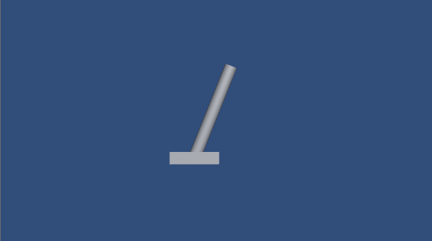
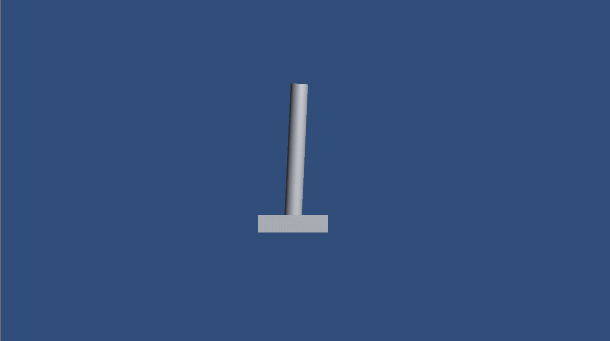

## EasyDQN

基于Unity的强化学习算法DQN的纯C#实现，Sample是一个Cart-Pole环境。

训练刚开始时：

训练200个episode之后：

---

A simple implementation of the reinforcement learning algorithm DQN in pure C#, and a Cart-Pole environment is used in the sample case.

Beginning of the training:

After training 200+ episodes:

